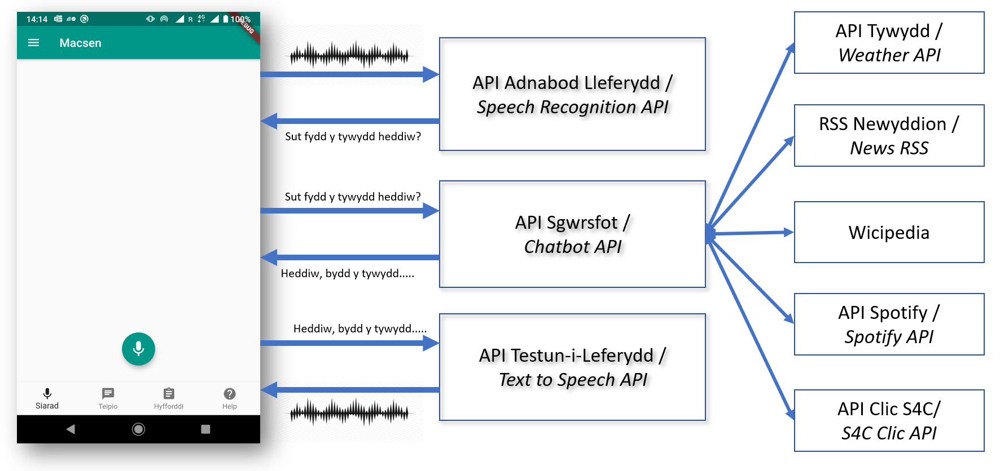
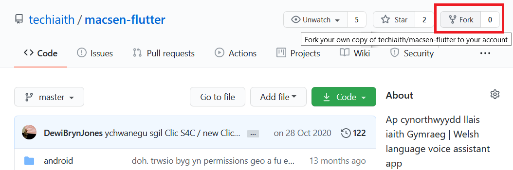
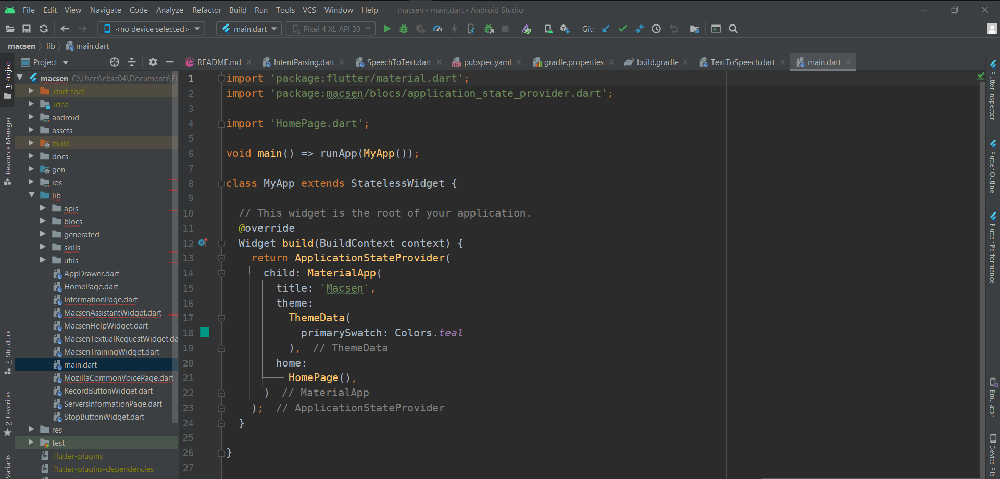
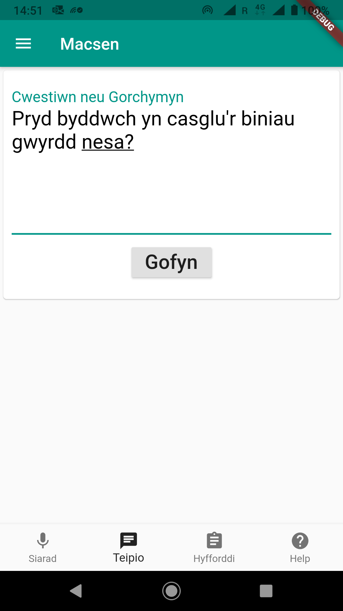

*(to read this page in English, goto [README_en.md](README_en.md))*

# Addasu Macsen

Bwriad y ddogfennaeth hon yw darparu gwybodaeth i gynorthwyo datblygwyr
meddalwedd wrth iddyn nhw fabwysiadu'r ap cynorthwyydd llais Macsen a'i dechnolegau
iaith i brojectau a dibenion eu hunain.

Rydyn yn rhagweld bydd datblygwyr eisiau wireddu un neu fwy o’r tri
amcan canlynol:

- adeiladu a gosod cod Flutter Macsen

- gosod a defnyddio gweinydd Macsen eich hunain

- creu a defnyddio sgiliau eu hunain

<br/>

## Cynnwys
 - 1 [Trosolwg o Feddalwedd Macsen](#1-trosolwg-o-feddalwed-macsen)
 - 2 [Adeiladu a gosod cod ap Macsen](#2-adeiladu-a-gosod-cod-ap-macsen)
   - 2.1 [Flutter](#21-flutter)
   - 2.2 [Pensaernïaeth Cod Macsen](#22-pensaern%C3%AFaeth-cod-macsen)
 - 3 [Gosod a Defnyddio gweinydd Macsen eich hunain](#3-gosod-a-defnyddio-gweinydd-macsen-eich-hunain)
   - 3.1 [Gosod gweinydd adnabod lleferydd](#31-gosod-gweinydd-adnabod-lleferydd)
   - 3.2 [Gosod gweinydd sgwrsfot](#32-gosod-gweinydd-sgwrsfot)
     - 3.2.1 [OpenWeatherMap](#321-openweathermap)
     - 3.2.2 [TimezoneDB](#322-timezonedb)
     - 3.2.3 [Spotify](#323-spotify)
   - 3.3 [Gosod gweinydd testun-i-leferydd](#33-gosod-gweinydd-testun-i-leferydd)
   - 3.4 [Addasu'r ap ar gyfer gweinyddion technolegau iaith eich hunain](#34-addasur-ap-ar-gyfer-gweinyddion-technolegau-iaith-eich-hunain)
 - 4 [Ychwanegu sgil eich hunain i Macsen](#4-ychwanegu-sgil-eich-hunain-i-macsen)
     - 4.1 [Ychwanegu sgil newydd i'r cydran sgwrsfot](#41-ychwanegu-sgil-newydd-ir-cydran-sgwrsfot)
     - 4.2 [Ychwanegu sgil newydd i'r cydran adnabod lleferydd](#42-ychwanegu-sgil-newydd-ir-cydran-adnabod-lleferydd)
     - 4.3 [Beth i’w addasu o fewn yr ap ar gyfer sgil newydd](#43-beth-iw-addasu-o-fewn-yr-ap-ar-gyfer-sgil-newydd)
 
<br/>

## 1 Trosolwg o feddalwed Macsen

Gwireddwyd nodweddion ieithyddol soffistigedig Macsen, sef adnabod lleferydd, deall bwriad, 
darparu sgiliau a thestun-i-leferydd, i redeg ar weinydd ar ran yr ap. Maent ar gael i'r ap o
amrywiaeth o APIs ar-lein. Mae cod yr ap o ganlyniad dim ond yn ddarparu rhyngwyneb ac
yn chydlynu'r galwadau i’r wahanol APIs.

Mae'r darlun canlynol yn dangos cynllun cydrannau Macsen a sut rhennir wahanol swyddogaethau
rhwng y ddyfais iOS/Android a gweinyddion.


*Cynllun Meddalwedd Macsen*

Fel y gwelir, mae'r ap yn yrru ac yn derbyn negeseuon sy'n cynnwys sain neu testun. 

Ar ôl i'r defnyddiwr lefaru cwestiwn neu orchymyn i'r ap, mae'r ap yn gyrru sain
y cais at weinydd adnabod lleferydd er mwyn i'w trosi i destun. 

Mae'r ap yn defnyddio'r testun ar gyfer holi gweinydd sgwrsfot ac i dderbyn gwybodaeth ar
ffurf testun mewn iaith naturiol. I wneud hyn, mae'r sgwrsfot yn ceisio deall y bwriad o
fewn y testun er mwyn galw'r gwasanaeth(au) API allanol perthnasol, gyda pharamedrau wedi'i 
echdynnu o'r testun i helpu gwireddu dymuniad y defnyddiwr. 

e.e. Adnabyddir a thosi'r "*Beth yw newyddion Cymru?*" fel galwad http i ffrwd RSS
`https://golwg360.cymru/cymru/ffrwd`

Yna, mae'r sgwrsfot yn ail-ffurfio'r canlyniad i gyfres o frawddegau naturiol i'w 
yrru nól at yr ap. 

Mae'r ap yn lefaru pob pennawd drwy yrru cais at weinydd testun-i-leferydd a chwarae'r 
sain mae'n derbyn.

<br/>

## 2 Adeiladu a gosod cod ap Macsen

Os hoffwch chi osod gweinydd Macsen eich hunain ac/neu greu sgil eich hunain, bydd 
rhaid i chi allu addasu, adeiladu a gosod ap Macsen eich hunain.

Cyn dechrau ar addasu cod ap Macsen, rydym yn argymell, er hwylustod, fforchio'r cod
ar GitHub (https://github.com/techiaith/macsen-flutter) drwy glicio ar y botwm ‘Fork’ 
ar frig y dudalen.


*Fforchio cod ap Macsen ar GitHub*

### 2.1 Flutter

Datblygir ap Macsen gyda'r iaith rhaglennu Flutter (https://flutter.dev/) gan Google. 
Bydd angen i chi felly gosod Flutter ar eich peiriant datblygu. 

Mae tudalen cyfarwyddiadau gosod Flutter ar Windows, Mac OS X ac/neu Linux fan hyn:

[*https://flutter.dev/docs/get-started/install*](https://flutter.dev/docs/get-started/install)

**D.S.** os hoffech chi osod addasiad o Macsen ar ddyfais iOS, bydd rhaid i chi ddefnyddio 
Flutter ar beiriant Mac OS X. Byddwch angen xCode wedi ei osod hefyd.

Mae’r cyfarwyddiadau hefyd yn esbonio sut gellir datblygu apiau Flutter gyda AndroidStudio 
neu Visual Studio Code. Bydd y ddogfennaeth hon yn canolbwyntio ar AndroidStudio.


*Cod Macsen o fewn AndroidStudio*


### 2.2 Pensaernïaeth Cod Flutter Ap Macsen

Mae rhan helaeth cod Flutter ap Macsen yn bodoli o fewn y ffolder ‘lib’

[*https://github.com/techiaith/macsen-flutter/tree/master/lib*](https://github.com/techiaith/macsen-flutter/tree/master/lib)

Yma gwelir ffeiliau cod Flutter gydag enwau sy’n gorffen gyda ‘Widget.dart’ ar gyfer 
pob elfen o’r rhyngwyneb, fel botymau, cynnwys tudalennau tabiau.

Mae cod ar gyfer system weithredu benodol, ynghyd â wybodaeth pecynnu, o fewn y 
ffolderi 'iOS' neu 'Android' perthnasol.

Ar gyfer Android, mae modd newid manylion pecynnu, gan gynnwys newid enw ac 
eiconau'r ap o fewn AndroidManifest.xml:

[*https://github.com/techiaith/macsen-flutter/blob/master/android/app/src/main/AndroidManifest.xml*](https://github.com/techiaith/macsen-flutter/blob/master/android/app/src/main/AndroidManifest.xml)

Ar gyfer iOS, mae modd newid hunaniaeth yr ap o fewn rhyngwyneb arferol xCode neu 
drwy olygu’r ffeil Info.plist

[*https://github.com/techiaith/macsen-flutter/blob/master/ios/Runner/Info.plist*](https://github.com/techiaith/macsen-flutter/blob/master/ios/Runner/Info.plist)

<br/>

## 3 Gosod a Defnyddio gweinydd Macsen eich hunain

Mae sawl rheswm am eisio defnyddio gweinyddion eich hunain i wasanaethu’r ap yn 
lle ddarpariaeth Uned Technolegau iaith, Prifysgol Bangor, gan gynnwys preifatrwydd 
a defnyddio sgiliau eich hunain.

Mae’r cydrannau i gyd wedi eu pecynnu gyda Docker, sydd yn hwyluso'n sylweddol 
gosod ar unrhyw fath o weinydd. Yn ein dogfennaeth rydym am esbonio yng nghyd-destun 
gweinydd Linux. Defnyddiwch y ddogfennaeth canlynol gan Docker i’w osod ar eich 
gyfrifiadur chi:

[*https://docs.docker.com/get-docker/*](https://docs.docker.com/get-docker/)

**D.S.** bydd rhaid i chi addasu cod yr ap er mwyn iddo defnyddio unrhyw wasanaeth
API amgen.
(gweler *“Beth i’w addasu o fewn yr ap ar gyfer gweinydd eich hunain”*)


### 3.1 Gosod gweinydd adnabod lleferydd

Mae'r cyfarwyddiadau llawn ar gyfer osod gweinydd adnabod lleferydd gyffredinol eich 
hunain ar gael o GitHub:

[*https://github.com/techiaith/docker-deepspeech-cy-server*](https://github.com/techiaith/docker-deepspeech-cy-server)

Dilynwch y camau canlynol er mwyn ei redeg fel API sy’n gallu adnabod
cwestiynau a gorchmynion diweddaraf Macsen:

```
$ git clone https:// github.com/techiaith/docker-deepspeech-server-cy.git
$ cd docker-deepspeech-server-cy
$ make build-macsen
$ make run-macsen

```

Bydd cynhwysydd Docker newydd o’r enw ‘deepspeech-server-macsen’ yn
ymddangos yng nghanlyniadau:

```
$ docker ps
CONTAINER ID  IMAGE                                     COMMAND                 CREATED      STATUS      PORTS                   NAMES
bba568430871  techiaith/deepspeech-0.9.1-server:macsen  "/bin/bash -c /deeps…"  5 weeks ago  Up 5 weeks  0.0.0.0:5503->8008/tcp  deepspeech-server-macsen
```

Gyda'r gwasanaeth ar gael o borth 5503, defnyddiwch y gorchymyn canlynol i'w brofi:

```
$ curl -F 'soundfile=@question.wav' localhost:5503/speech\_to\_text/
```

Dyle rhoi'r ateb:

```
{success": true, "version": 1, "text": "beth yw newyddion cymru"}
```

Dylid cysylltu `localhost:5503` i gyfeiriad gwe gyraeddadwy i'r ap drwy ychwanegu
dirprwy i ffurfweddiad eich gweinydd gwe. Dyma enghraifft ychwanegu ddirprwy 
ar gyfer Macsen i weinydd we nginx:

```
location /deepspeech/macsen/ {
   proxy_set_header X-Forwarded-For $proxy_add_x_forwarded_for;
   proxy_set_header Host $http_host;
   proxy_set_header X-Real-IP $remote_addr;
   proxy_pass http://localhost:5503/;
}
```


### 3.2 Gosod gweinydd sgwrsfot

Mae’r cod ffynhonnell cydran sgwrsfot Macsen gyda chyfarwyddiadau i osod gweinydd 
eich hunain ar gael o GitHub:

[*https://github.com/techiaith/macsen-sgwrsfot*](https://github.com/techiaith/macsen-sgwrsfot)

Dilynwch y camau canlynol er mwyn ei redeg fel API sy'n gallu adnabod bwriad cais
defnyddiwr a ffurfio atebion, ar gyfer yr ap Macsen, ar ffurf iaith naturiol:

```
$ git clone https://github.com/techiaith/macsen-sgwrsfot.git
$ cd macsen-sgwrsfot
```

Er mwyn llwyddo integreiddio APIs drydydd parti, bydd angen i chi derbyn sawl 
allwedd API eich hunain. Yn benodol:

##### 3.2.1 OpenWeatherMap:

[*https://openweathermap.org/api*](https://openweathermap.org/api) .
Mae cynnig tanysgrifiad am ddim yn ddigonol. Wedi i chi derbyn eich
allwedd API, creuwch ffeil o’r enw `apikey.py` yn [`server/assistant/skills/tywydd/owm`](https://github.com/techiaith/macsen-sgwrsfot/tree/master/server/assistant/skills/tywydd/owm) 
gyda'r cynnwys :

```
#!/usr/bin/env python
# -\*- coding: utf-8 -\*-

OWM_API_KEY = <eich allwedd API OpenWeatherMap>
```


##### 3.2.2 TimezoneDB: 

[*https://timezonedb.com/*](https://timezonedb.com/) .
Eto, mae’r darpariaeth rhad ac am ddim yn ddigonol. Bydd angen creu
ffeil `apikey.py` yn [`server/assistant/skills/amser/timezonedb`](https://github.com/techiaith/macsen-sgwrsfot/tree/master/server/assistant/skills/amser) gyda cynnwys
debyg i:

```
#!/usr/bin/env python
# -\*- coding: utf-8 -\*-

TIMEZONEDB_API_KEY = <eich allwedd API TimezoneDB>
```

##### 3.2.3 Spotify:

[*https://developer.spotify.com/documentation/web-api/*](https://developer.spotify.com/documentation/web-api/).
Mae modd defnyddio’r API Spotify ar-lein yn rhad ac am ddim. Bydd angen
creu ffeil `apikey.py` yn [`server/assistant/skills/spotify/api`](https://github.com/techiaith/macsen-sgwrsfot/tree/master/server/assistant/skills/spotify/api) 
gyda cynnwys tebyg i:

```
CLIENT_ID=<eich allwedd client_id gan Spotify>
CLIENT_SECRET=<eich allwedd client_secret gan Spotify>
```

Wedi i chi ychwanegu allweddi API eich hunain, mae modd cychwyn y gweinydd sgwrsfot 
drwy ddefnyddio’r gorchmynion:

```
$ make
$ make mysql
$ make run
```

Bydd cynhwysydd Docker newydd o’r enw 'skills-server' yn ymddangos yng
nghanlyniadau

```
$ docker ps
CONTAINER ID  IMAGE                          COMMAND                 CREATED       STATUS       PORTS                   NAMES
cf498d481520  techiaith/skills-server-20.10  "/bin/bash -c /opt/s…"  4 months ago  Up 4 months  0.0.0.0:5456->8008/tcp  skills-server-20.10
16e63610b9d6  mysql                          "docker-entrypoint.s…"  2 years ago   Up 4 months  3306/tcp                skills-online-mysql
```

Gyda gwasanaeth ar gael o borth 5456. Defnyddiwch y gorchymyn:

```
$ curl https://localhost:5456/perform_skill?text=Beth+fydd+y+tywydd+yfory+ym+Mhwllheli
```

I wirio os yw’n gweithio’n iawn. Dyle rhoi yn ateb:

```json
{
    "intent": "beth.fydd.y.tywydd",
    "version": 1,
    "success": true
    "result": [
        {
            "title": "Dyma tywydd yfory gan OpenWeatherMap ar gyfer Pwllheli.",
            "description": "",
            "url": ""
        },
        {
            "title": ""
            "description": "Yfory am 9 o'r gloch yn y bore bydd hi'n bwrw glaw a'r tymheredd fydd 8 gradd Celsius.",
            "url": "",
        },
        {
            "title": ""
            "description": "Yn hwyrach yfory am hanner dydd bydd hi'n bwrw glaw a'r tymheredd yn 9 gradd Celsius.",
            "url": "",
        }
    ],
}
```

Dylid cysylltu localhost:5456 i gyfeiriad gwe gyraeddadwy i'r ap drwy ychwanegu
dirprwy i ffurfweddiad eich gweinydd gwe. Dyma enghraifft ychwanegu ddirprwy 
ar gyfer Macsen i weinydd we nginx:

```
location /assistant/ {
    proxy_set_header X-Forwarded-For $proxy_add_x_forwarded_for;
    proxy_set_header Host $http_host;
    proxy_set_header X-Real-IP $remote_addr;
    proxy_pass http://localhost:5456/;
}
```


### 3.3 Gosod gweinydd testun-i-leferydd

Mae'r cod ffynhonnell gyda chyfarwyddiadau i osod testun-i-leferydd ar gyfer 
Macsen ar weinydd amgen ar gael o GitHub:

[*https://github.com/techiaith/docker-marytts*](https://github.com/techiaith/docker-marytts)

Dilynwch y camau canlynol er mwyn ei redeg fel API sy'n gallu cynhyrchu'r sain 
lleferydd bydd Macsen yn ei chwarae

```
$ git clone https://github.com/techiaith/docker-marytts.git
$ cd docker-marytts
$ make

$ cd server
$ make
$ make run
```

Bydd cynhwysydd Docker newydd o’r enw 'marytts-server' yn
ymddangos yng nghanlyniadau:

```
$ docker ps
CONTAINER ID  IMAGE                           COMMAND                 CREATED       STATUS       PORTS                                             NAMES
df7e7d9ca2e4  techiaith/marytts-server:20.10  "/usr/bin/supervisord"  4 months ago  Up 4 months  0.0.0.0:5301->8008/tcp, 0.0.0.0:52010->59125/tcp  marytts-server-20.10
```

Gyda gwasanaeth lleferydd ar gael o borth 5301 a 59125. Defnyddiwch y gorchymyn:

```
\$ curl "localhost:5301/speak?text=mae'n+glawiog+gyda+ysbeidiau+heulog&format=wav" -o tywydd.wav
```

I wirio os yw’n gweithio’n iawn. Gallwch wrando ar y ffeil newydd neu
wirio’i fformat ei chynnwys:

```
$ file tywydd.wav
tywydd.wav: RIFF (little-endian) data, WAVE audio, Microsoft PCM, 16 bit, mono 16000 Hz
```

Mae modd cysylltu `localhost:5301` i gyfeiriad gwe gyraeddadwy i’r ap drwy
ffurfweddu dirprwy ar eich gweinydd gwe. Er enghraifft, ar nginx gellir
ychwanegu:

```
location /marytts/ {
   proxy_set_header X-Forwarded-For $proxy_add_x_forwarded_for;
   proxy_set_header Host $http_host;
   proxy_set_header X-Real-IP $remote_addr;
   proxy_pass http://localhost:5301/;
}
```

### 3.4 Addasu'r ap ar gyfer gweinyddion technolegau iaith eich hunain

Gwelir y cod Flutter ar gyfer galw ar yr APIs wahanol gweinyddion technoleg iaith yn

[*https://github.com/techiaith/macsen-flutter/tree/master/lib/apis*](https://github.com/techiaith/macsen-flutter/tree/master/lib/apis)

Wedi i chi osod gweinyddion APIs adnabod lleferydd, sgwrsfot ac/neu testun-i-leferydd 
eich hunain bydd modd i chi newid y cyfeiriadau URL i gysylltu’r ap drwy newid un neu 
mwy o’r tri newidyn canlynol:

`SpeechToText.dart::_apiAuthorityUrl`

`IntentParsing.dart::_apiAuthorityUrl`

`TextToSpeech.dart::_apiAuthorityUrl`

<br/>

## 4 Ychwanegu sgil eich hunain i Macsen

Er mwyn ychwanegu sgil eich hunain i Macsen, bydd angen i chi addasu'r gweinyddion 
sgwrsfot ac adnabod lleferydd ar y cyd, ac o bosib yr ap hefyd. 

Os yw’r sgil yn un syml, fel gofyn cwestiynau er mwyn cael ateb, yna nid oes angen
addasu cod yr ap o gwbl ar gyfer eich sgil newydd. 

Mae’r tabl canlynol yn gynnig trosolwg o ba elfennau Macsen sydd angen eu haddasu 
yn ôl y fath o sgil newydd.

| **Sgop sgil newydd** | **Lleiafswm sydd angen eu haddasu** |
| ------ | ------ |
| Gofyn cwestiwn am wybodaeth ‘static’ (h.y. yn rhoi’r un ateb bob tro) | Sgwrsfot, Adnabod Lleferydd |
| Gofyn cwestiwn am wybodaeth ‘deinamic’ (h.y. ateb sy’n dibynnu ar gyd-destun lleoliad, amser neu endid penodol) | Sgwrsfot gyda gysylltiad i API drydydd parti, DeepSpeech | 
| Gweithredu Tasg (e.e. rhoi golau ymlaen, amseru, chwaraea podlediad, troi’r radio ymlaen) | Sgwrsfot (gyda o bosib gysylltiad i API drydydd parti), DeepSpeech, Ap Macsen | 


Wedi i chi benderfynu ar eich sgil, cofnodwch yn fanwl pa weithredoedd bydd ddefnyddwyr 
eisio cyflawni gyda’ch sgil. E.e. cael ateb i gwestiwn cyffredin am eich sefydliad, 
cael ateb i gwestiwn ynghylch casgliadau biniau neu troi’r radio ymlaen i'ch sianel. 

Mae'n bosib bydd eich sgil yn gwasanaethu nifer o weithredoedd felly ffurfiwch y 
cwestiynau neu orchmynion iaith naturiol bydd defnyddwyr tebyg o'u lefaru i bob 
un weithred. Ceisiwch ffurfio brawddegau byr a syml iawn er mwyn cynyddu pa mor aml bydd 
y cydran adnabod lleferydd DeepSpeech Cymraeg yn llwyddo i'w hadnabod.

e.e. ar gyfer sgil biniau ac ailgylchu cyngor lleol - “Beth ydi’r gwasanaeth
biniau ac ail-gylchu?”, “Sut mae cael bin brown newydd?”, “Pryd mae’n diwrnod 
casglu biniau gwyrdd?”. 

Gellir gofyn yr un cwestiwn mewn nifer o ffyrdd – “Pa diwrnodau ydych chi biniau 
gwyrdd?”. Trefnwch y cwestiynau i wahanol categorïau 'bwriad' gyda label cryno:

```
  --------------------------------------------------------------------
  Bwriad                 Cwestiynau Bosib
  ---------------------- ---------------------------------------------
  beth.ydyr.gwasanaeth   Beth ydi’r gwasanaeth biniau ac ail-gylchu?
                         
                         Beth yw’r gwasanaeth biniau ac ail-gylchu?
                         
                         Beth ydi’r gwasanaeth biniau?
                         
                         Beth ydi’r gwasanaeth ail-gylchu?

  diwrnodau.casglu       Pryd mae’n diwrnod biniau?
                         
                         Pa bryd mae’n diwrnod casglu biniau?
                         
                         Pa diwrnodau chi’n casglu biniau?

  bin.newydd             Ga i finiau newydd os gwelwch yn dda?
  --------------------------------------------------------------------
```

### 4.1 Ychwanegu sgil newydd i'r cydran sgwrsfot

I ddechrau wireddu’r sgil yn y sgwrsfot, bydd angen creu ffolder newydd ar ei gyfer 
yn y man briodol o fewn strwythr ffolderi sgwrsfot Macsen. E.e. **`biniau_ac_ailgylchu`**

```
macsen-sgwrsfot/server/assistant/skills $ ls -l
amser
biniau_ac_ailgylchu
clic
larwm
newyddion
spotify
tywydd
wicipedia
```

O fewn eich ffolder newydd, creuwch ffolder arall o’r enw `intents`.

Bydd y ffolder hwn yn cynnwys ffolder ar gyfer pob bwriad rydych wedi canfod yn 
eich tabl bwriadon gyda cwestiynau blaenorol. Enwch pob un gyda'r talfyriad

e.e. `assistant/skills/biniau/intents/diwrnodau.casglu`

o fewn y ffolder yna, creu ffeil gyda’r estyniad `.intent`

e.e. `assistant/skills/biniau/intents/diwrnodau.casglu/diwrnodau.casglu.intent`

Rhowch pob cwestiwn bosibl ar gyfer y bwriad o fewn y ffeil `.intent`

`diwrnodau.casglu.intent`:
```
Pryd mae rhoi’r biniau allan nesa?
Pa diwrnod mae’r biniau?
```

Os hoffwch chi cynnwys defnyddio enw priod, fel enw tref, o fewn y cwestiwn, yna 
defnyddiwch y ddull canlynol:

`diwrnodau.casglu.intent`:
```
Pryd mae rhoi’r biniau allan nesa?
Pa diwrnod mae’r biniau?
Pryd mae biniau {tref}?
```

Ac yna creu ffeil o’r enw `tref.entities` i gynnwys enwau trefi y gwasanaeth..

`tref.entities`:
```
Pwllheli
Porthmadog
Caernarfon
Botwnnog
```

Yn olaf, mae’n bosib nodi allwedd eiriau ar gyfer eich cwestiynau er mwyn cyfnerthu’r 
adnabod bwriad. Crëwch ffeil sy'n cychwyn gydag enw’r sgil ac yna `keyword.entities`. Yn achos y sgil
biniau ac ail-gylchu, mae’r gair `biniau` ac `ail-gylchu` yn eithaf unigryw:

`biniau_ac_ailgylchu_keyword.entities` :
```
biniau
ail-gylchu
```

Yn nesaf, mae angen sgwennu cod i ffurfio atebion i pob cais. Creuwch ffeil Python 
gyda enw’r sgil yn frig ffolder y sgil:

e.e. `assistant/skills/biniau/biniau_ac_ailgylchu.py`

Rhaid dilyn y patrwm templed ar gyfer pob sgil:

```python
#!/usr/bin/env python3
# -*- coding: utf-8 -*-
import os
import requests
import json

from Skill import Skill
from padatious import IntentContainer

class biniau_ac_ailgylchu_skill(Skill):

    def __init__(self, root_dir, name, nlp, active):
        super(clic_skill, self).__init__(root_dir, name, nlp, active)

    def handle(self, intent_parser_result, latitude, longitude):
        skill_response = []

        # mae'r gwrthrych intent_parser_result yn cynnwys data er mwyn
        # deall beth dylid 
        intent_parser_result.name    # : enw'r bwriad adnabyddwyd o'r cwestiwn/gorchymyn
        intent_parser_result.matches # : rhestr o unrhyw enwau priod sydd o fewn cais y defnyddiwr
                                       
                
        context = intent_parser_result.matches
        for key, value in context.items():
            context[key] = context[key].replace("?", "")

        # mae'n bosib cyfeirio at cod i fwriad benodol...
        if intent_parser_result.name=='diwrnodau.casglu.intent':
            binday = get_bin_day(context['tref'])
            
            # ac i roi'r gwybodaeth i ymateb i Macsen, ychwanegwch i rhestr
            # 'skills_response' cofnod gyda meysydd 'title', 'description' a 
            # 'url'
            skills_response.append({'title': "Diwrnod casglu biniau",
                                    'description': "Byddwn yn casglu eich bin ar ddydd " + binday.day_in_welsh,
                                    'url': 'https://cyngor.cymru/biniau_ac_ailgylchu/casglu'})
        else ....
        
        return skills_response
        
```


Yna ychwanegwch enw'r sgil i'r ffwythiant `__init__` o fewn `Brain.py` sydd yn y ffolder `assistant/`

```python
self.load_skill(skills_root_dir, 'tywydd')
self.load_skill(skills_root_dir, 'newyddion')
...
self.load_skill(skills_root_dir, 'clic')
self.load_skill(skills_root_dir, 'biniau_ac_ailgylchu')
```

Yna, ail-gychwynwch eich gweinydd:

```
$ make stop
$ make
$ make run
```

A profwch eich sgil drwy

`http://localhost:5455/perform_skill?text=Pryd+fydd+y+biniau+nesa?`

Os yw'r sgil yn rhedeg o fewn API sgwrsfot sydd ar gael i'ch ap Macsen, yna
modd modd profi'r sgil o fewn Macsen o rhyngwyneb teipio yr ap. 



Ond, os hoffwch i'ch defnyddwyr defnyddio eich sgil ar lafar, yna rhaid addasu'r 
cydran adnabod lleferydd hefyd.


### 4.2 Ychwanegu sgil newydd i'r cydran adnabod lleferydd

Er mwyn i ddefnyddwyr defnyddio'ch sgil Macsen ar lafar, bydd rhaid i chi ail-hyfforddi'r 
model iaith defnyddir gan y gweinydd adnabod lleferydd DeepSpeech a ddisodli'r model
rhagosodiedig `techiaith_bangor_macsen_21.01.scorer`.

Cyn dechrau, gwirich bod eich gweinydd sgwrsfor ar gael a bod yr URL canlynol yn 
rhestru'r frawddegau newydd eich sgil..

e.e.:

`http://<cyfieiriad gwe eich sefydliad/gweinydd>/macsen/assistant/get_all_sentences`


Mae'r sgriptiau ar gyfer hyfforddi modelau DeepSpeech ar gael o GitHub 

[*https://github.com/techiaith/docker-deepspeech-cy*](https://github.com/techiaith/docker-deepspeech-cy)


```
$ git clone https://github.com/techiaith/docker-deepspeech-cy.git
$ make
```

Yna i gychwyn ac hyfforddi o fewn y cynhwysydd Docker...

```
$ make run
docker run --gpus all --name techiaith-deepspeech-train-v0.9.3-techiaith -it \
        -v ./data/:/data \
        -v ./checkpoints/:/checkpoints \
        -v ./models/:/models \
        -v ./export/:/export \
        -v ./homedir/:/root \
        -v ./local/:/DeepSpeech/bin/bangor_welsh \
        --env DEEPSPEECH_RELEASE=0.9.3 \
        --env TECHIAITH_RELEASE=21.03 \
        techiaith/deepspeech-train:v0.9.3 bash

________                               _______________
___  __/__________________________________  ____/__  /________      __
__  /  _  _ \_  __ \_  ___/  __ \_  ___/_  /_   __  /_  __ \_ | /| / /
_  /   /  __/  / / /(__  )/ /_/ /  /   _  __/   _  / / /_/ /_ |/ |/ /
/_/    \___//_/ /_//____/ \____//_/    /_/      /_/  \____/____/|__/

tf-docker /DeepSpeech > cd bin/bangor_welsh
tf-docker /DeepSpeech/bib/bangor_welsh > import_custom_macsen_text_corpus.py \
 -u http://cyngor.cymru/macsen/assistant/get_all_sentences \
 -t /data/custom_macsen
```

Ar ôl i hyn estyn a threfnu brawddegau eich sgil, defnyddiwch 

```
tf-docker /DeepSpeech/bib/bangor_welsh > build_lm_scorer.sh \
    --text_file /data/custom_macsen/corpws.clean.txt \
    --output_dir /data/custom_macsen/lm
    --domain macsen
```

Ar ôl ychydig o funudau, bydd ffeil o’r enw `kenlm.scorer` yn bodoli o fewn `--output_dir`

Copiwch eich ffeil `.scorer` newydd i leoliad eich gweinydd adnabod lleferydd DeepSpeech,
gan newid yr enw 

```
docker-deepspeech-server-cy $ ls -l models/macsen
-rw-rw-r-- 1 techiaith techiaith 189039023 Jan 25 14:09 techiaith_bangor_21.01.pbmm
-rw-rw-r-- 1 techiaith techiaith     80880 Jan 27 07:45 cyngor_macsen_21.01.scorer
```

Gofalwch eich bod yn dileu'r ffeil `techiaith_bangor_macsen_21.01.scorer`.

Ail-gychwynwch y gweinydd adnabod lleferydd

```
docker-deepspeech-server-cy $ make stop
docker-deepspeech-server-cy $ make
docker-deepspeech-server-cy $ make run
```

Os yw eich ap wedi ei ffurfweddu i gysylltu i'ch weinydd adnabod lleferydd DeepSpeech,
yna ceisiwch gofyn un o'ch cwestiynau ar lafar. 

### 4.3 Beth i’w addasu o fewn yr ap ar gyfer sgil newydd

Os rydych chi wedi ddatblygu'r weinyddion API i fedru ddarparu sgil newydd eich
hunain, yna mae'n bosib bydd angen newidiadau i cod ap Macsen hefyd o ganlyniad.

Mae'r is-ffolder `/skills` yn cynnwys y cod sydd ei hangen ar gyfer cyflawni sgiliau
benodol yn ogystal a fathau o sgiliau.

[*https://github.com/techiaith/macsen-flutter/tree/master/lib/skills*](https://github.com/techiaith/macsen-flutter/tree/master/lib/skills)

Er enghraifft, mae'r cod `Spotify` yn gysylltu gyda'r ap Spotify ar y ddyfais er 
mwyn gwblhau dymuniad y ddefnyddiwr i chwarae fiwsig. 

Gellir defnyddio'r cod o fewn `*question_answer*` ar gyfer nifer o wahanol sgiliau
sydd, yn y bôn, yn sgiliau gofyn cwestiwn er mwyn derbyn gwybodaeth newydd. Hynny 
yw, mae’r defnyddiwr yn gofyn cwestiwn ar lafar ac mae’r ap yn rhoid ateb ac/neu 
gyfres o atebion bosibl. Wrth ddangos a llefaru testun yr ymateb, mae cod 
`*question_answer*` yn darparu botwm ‘Darllen rhagor..’ i'r defnyddiwr ei ddefnyddio
i agor dolen i dudalen we gyda rhagor o wybodaeth gysylltiedig.
