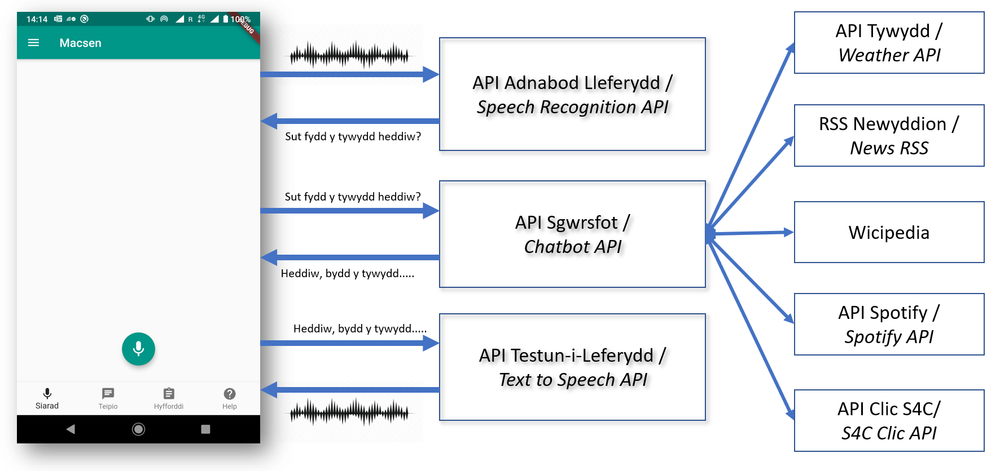
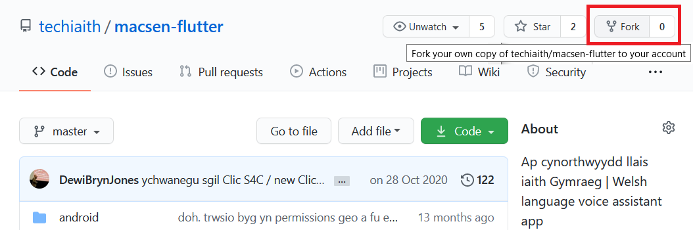
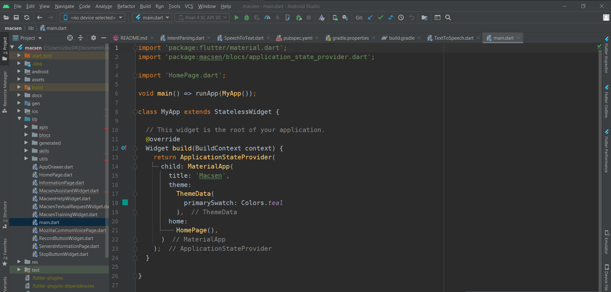
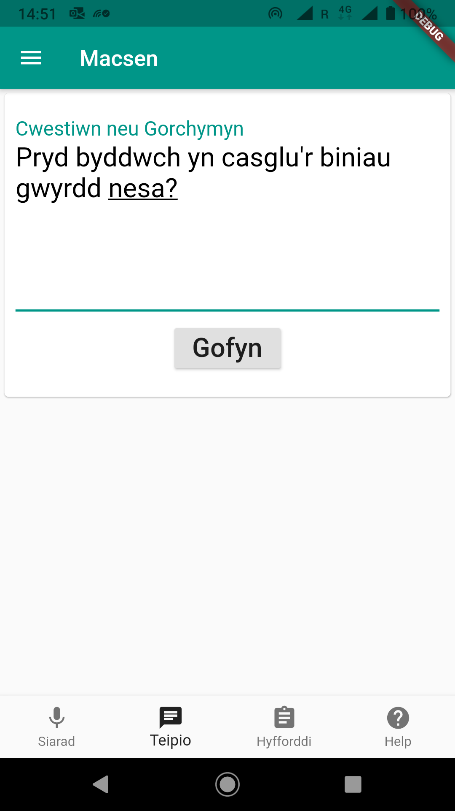

# Adaptation of Macsen

This documentation is intended to provide information to assist software developers
as they adopt the Macsen Welsh language voice assistant ap and its language technologies
into their own projects and purposes.

We anticipate that developers will want to realize one or more of the three
following objectives:

- build and install Flutter Macsen code

- install and use your own Macsen server

- create and use your own skills
 
<br/>
 
## Cynnwys
 - 1 [Overview of Macsen's Software](#1-overview-of-macsens-software)
 - 2 [Building and installing the Macsen app code](#2-building-and-installing-the-macsen-app-code)
   - 2.1 [Flutter](#21-flutter)
   - 2.2 [Macsen app code architecture](#22-macsen-app-code-architecture)
 - 3 [Deploy your own Macsen servers](#3-deploy-your-own-macsen-servers)
   - 3.1 [Installing a speech recognition server](#31-installing-a-speech-recognition-server)
   - 3.2 [Installing a Chatbot server](#32-installing-a-chatbot-server)
     - 3.2.1 [OpenWeatherMap](#321-openweathermap)
     - 3.2.2 [TimezoneDB](#322-timezonedb)
     - 3.2.3 [Spotify](#323-spotify)
   - 3.3 [Installing a text-to-speech server](#33-installing-a-text-to-speech-server)
   - 3.4 [Adapting the app to your own API servers](#34-adapting-the-app-to-your-own-api-servers)
 - 4 [Add a new skill to Macsen](#4-add-a-new-skill-to-macsen)
     - 4.1 [Adding a new skill to the chatbot server API](#41-adding-a-new-skill-to-the-chatbot-server-api)
     - 4.2 [Adding a new skill to the speech recognotion server API](#42-adding-a-new-skill-to-the-speech-recognotion-server-api)
     - 4.3 [Adapting Macsen app code for a new skill](#43-adapting-macsen-app-code-for-a-new-skill)
 
<br/>

## 1 Overview of Macsen's Software

Macsen's sophisticated linguistic features, namely speech recognition, understanding intent,
provide skills and text-to-speech, run on a server and not in the app. They are available for 
the app from online APIs. The app code as a result is left to provide only an user interface and
coordinate the calls to the various APIs.

The following illustration shows the architecture of Macsen components and how 
different functions are divided between the iOS/Android device and servers.


*Macsen's Software Architecture*

As can be seen, the app sends and receives messages that contain audio or text.

After a user speaks to the app to ask a question or to command to the app, the app 
sends the audio to a speech recognition server for converting into text.

The app sends the text to a chatbot server for a response in text form in natural 
language. To do this, the chatbot tries to understand the intent of within the text 
and calls on relevant external API service(s), with parameters extracted from the text, 
to help fulfill the user's wish.


e.g. the text "*Beth yw newyddion Cymru?*" (*"What's the news in Wales?"*) is recognised
and executed as a http request to the Welsh language news service - Golwg360 - RSS feed:
`https://golwg360.cymru/cymru/ffrwd`

The chatbot then reconfigures the RSS feed result into a series of natural sentences
for sending back to the app.

The app in turn reads aloud each headline by sending a request to a text-to-speech API and 
playing the sound it receives.  

<br/>

## 2 Building and installing the Macsen app code

If you would like to install your own Macsen server and/or create your own skill(s), you 
must be able to customize, build and install the Macsen app yourself.

Before embarking on modifying the Macsen app code, we recommend that you fork the code
on GitHub (https://github.com/techiaith/macsen-flutter) by clicking the 'Fork' button
at the top of the page.


*Fforchio cod ap Macsen ar GitHub*

### 2.1 Flutter

The Macsen app has been implemented with the Flutter programming language (https://flutter.dev/) 
developed by Google. You will therefore need to install Flutter on your development machine.

Flutter installation instructions for Windows, Mac OS X or Linux can be found here:

[*https://flutter.dev/docs/get-started/install*](https://flutter.dev/docs/get-started/install)

**N.B.** if you would like to install Macsen on an iOS device, you will need to use Flutter 
on Mac OS X. You will also need xCode installed.

The instructions also explain how Flutter apps can be developed with AndroidStudio
or Visual Studio Code. This documentation will focus on AndroidStudio.


*Macsen code within AndroidStudio*


### 2.2 Macsen app code architecture

Much of Macsen's Flutter code exists within the 'lib' folder

[*https://github.com/techiaith/macsen-flutter/tree/master/lib*](https://github.com/techiaith/macsen-flutter/tree/master/lib)

Here are the Flutter code files with names ending with 'Widget.dart' that 
implement all user interface elements, such as microphone buttons and tab pages.

Code for a specific operating system, along with packaging information, is contained 
within the relevant 'iOS' or 'Android' folder.

Android packaging details can be changed, including changing the app's name and icons,
from the AndroidManifest.xml file:

[*https://github.com/techiaith/macsen-flutter/blob/master/android/app/src/main/AndroidManifest.xml*](https://github.com/techiaith/macsen-flutter/blob/master/android/app/src/main/AndroidManifest.xml)

The iOS app's identity can be changed within the normal xCode interface or by editing 
the Info.plist file

[*https://github.com/techiaith/macsen-flutter/blob/master/ios/Runner/Info.plist*](https://github.com/techiaith/macsen-flutter/blob/master/ios/Runner/Info.plist)

<br/>

## 3 Deploy your own Macsen servers

There are several reasons for wanting to deploy and use your own servers with the Macsen app
instead of the those provided by the Language Technologies Unit, Bangor University, 
including privacy and using own skills.

All of the server components have been packaged with Docker, which greatly improves
portability of the software to any type of server. In this documentation, we will 
be exampling in the context of a Linux server. 

Use the following documentation to install Docker on your server:

[*https://docs.docker.com/get-docker/*](https://docs.docker.com/get-docker/)

**N.B.** you will need to modify the app code if you set up any alternative API 
service 
(see *"What to customize within the app for your own server own"*)


### 3.1 Installing a speech recognition server

Full instructions for installing any general speech recognition server can be found
on GitHub at: 

[*https://github.com/techiaith/docker-deepspeech-cy-server*](https://github.com/techiaith/docker-deepspeech-cy-server)

However, use the following steps to run the speech recognition API with models 
optimized for recognizing Macsen's questions and commands:

```
$ git clone https:// github.com/techiaith/docker-deepspeech-server-cy.git
$ cd docker-deepspeech-server-cy
$ make build-macsen
$ make run-macsen

```

A new Docker container called 'deepspeech-server-macsen' will appear in the results of:

```
$ docker ps
CONTAINER ID  IMAGE                                     COMMAND                 CREATED      STATUS      PORTS                   NAMES
bba568430871  techiaith/deepspeech-0.9.1-server:macsen  "/bin/bash -c /deeps…"  5 weeks ago  Up 5 weeks  0.0.0.0:5503->8008/tcp  deepspeech-server-macsen
```

With the service available from port 5503, use the following command to test it:

```
$ curl -F 'soundfile=@question.wav' localhost:5503/speech\_to\_text/
```

Which should respond with:

```
{success": true, "version": 1, "text": "beth yw newyddion cymru"}
```

`localhost:5503` should be linked to an accessible web address so that the app 
can connect and access by adding a proxy in your web server configuration. Here is 
an example of how to add a proxy into an nginx web server:

```
location /deepspeech/macsen/ {
   proxy_set_header X-Forwarded-For $proxy_add_x_forwarded_for;
   proxy_set_header Host $http_host;
   proxy_set_header X-Real-IP $remote_addr;
   proxy_pass http://localhost:5503/;
}
```


### 3.2 Installing a Chatbot server

The source code for Macsen's chatbot API which has instructions for installing your 
own server and is available from GitHub:

[*https://github.com/techiaith/macsen-sgwrsfot*](https://github.com/techiaith/macsen-sgwrsfot)

However, use the following steps to run it as a API service for your Macsen app:

```
$ git clone https://github.com/techiaith/macsen-sgwrsfot.git
$ cd macsen-sgwrsfot
```

In order to successfully integrate third-party APIs, you will need to receive several
of your own API keys. Specifically:

##### 3.2.1 OpenWeatherMap:

[*https://openweathermap.org/api*](https://openweathermap.org/api) .

The free subscription offer is sufficient. Once you have received your
API key, create a file named `apikey.py` at [`server/assistant/skills/weather/owm`](https://github.com/techiaith/macsen-sgwrsfot/tree/master/server/assistant/skills/weather/owm)
with the content:

```
#!/usr/bin/env python
# -\*- coding: utf-8 -\*-

OWM_API_KEY = <your OpenWeatherMap API key>
```


##### 3.2.2 TimezoneDB: 

[*https://timezonedb.com/*](https://timezonedb.com/) .

Again, the free offer is adequate. You will need to create a file called `apikey.py` 
in [`server/assistant/skills/amser/timezonedb`](https://github.com/techiaith/macsen-sgwrsfot/tree/master/server/assistant/skills/amser) 
with content similar to:

```
#!/usr/bin/env python
# -\*- coding: utf-8 -\*-

TIMEZONEDB_API_KEY = <your TimezoneDB API key>
```

##### 3.2.3 Spotify:

[*https://developer.spotify.com/documentation/web-api/*](https://developer.spotify.com/documentation/web-api/).

The Spotify API can be used online for free. You will need to create file called
`apikey.py` at [`server/assistant/skills/spotify/api`](https://github.com/techiaith/macsen-sgwrsfot/tree/master/server/assistant/skills/spotify/api)
with content similar to:

```
CLIENT_ID=<your client_id from Spotify>
CLIENT_SECRET=<your client_secret from Spotify>
```

Once you have added your own API keys, the chatbot server can be started by using the commands:

```
$ make
$ make mysql
$ make run
```

A new Docker container called 'skills-server' will appear in:

```
$ docker ps
CONTAINER ID  IMAGE                          COMMAND                 CREATED       STATUS       PORTS                   NAMES
cf498d481520  techiaith/skills-server-20.10  "/bin/bash -c /opt/s…"  4 months ago  Up 4 months  0.0.0.0:5456->8008/tcp  skills-server-20.10
16e63610b9d6  mysql                          "docker-entrypoint.s…"  2 years ago   Up 4 months  3306/tcp                skills-online-mysql
```

With its service available from port 5456. Use the command:

```
$ curl https://localhost:5456/perform_skill?text=Beth+fydd+y+tywydd+yfory+ym+Mhwllheli
```

To check if it is working properly. It should respond with the weather information:

```json
{
    "intent": "beth.fydd.y.tywydd",
    "version": 1,
    "success": true
    "result": [
        {
            "title": "Dyma tywydd yfory gan OpenWeatherMap ar gyfer Pwllheli.",
            "description": "",
            "url": ""
        },
        {
            "title": ""
            "description": "Yfory am 9 o'r gloch yn y bore bydd hi'n bwrw glaw a'r tymheredd fydd 8 gradd Celsius.",
            "url": "",
        },
        {
            "title": ""
            "description": "Yn hwyrach yfory am hanner dydd bydd hi'n bwrw glaw a'r tymheredd yn 9 gradd Celsius.",
            "url": "",
        }
    ],
}
```

`localhost:5456` should be linked to an accessible web address so that the app 
can connect and access by adding a proxy in your web server configuration. Here is 
an example of how to add a proxy into an nginx web server:

```
location /assistant/ {
    proxy_set_header X-Forwarded-For $proxy_add_x_forwarded_for;
    proxy_set_header Host $http_host;
    proxy_set_header X-Real-IP $remote_addr;
    proxy_pass http://localhost:5456/;
}
```


### 3.3 Installing a text-to-speech server

The source code for Macsen's text-to-speech API has instructions for installing your 
own server and is available from GitHub

[*https://github.com/techiaith/docker-marytts*](https://github.com/techiaith/docker-marytts)

However, use the following steps to run it as a API service for your Macsen app:


```
$ git clone https://github.com/techiaith/docker-marytts.git
$ cd docker-marytts
$ make

$ cd server
$ make
$ make run
```

A new Docker container called 'marytts-server' will appear in:

```
$ docker ps
CONTAINER ID  IMAGE                           COMMAND                 CREATED       STATUS       PORTS                                             NAMES
df7e7d9ca2e4  techiaith/marytts-server:20.10  "/usr/bin/supervisord"  4 months ago  Up 4 months  0.0.0.0:5301->8008/tcp, 0.0.0.0:52010->59125/tcp  marytts-server-20.10
```

With its service available from port 5301 and 59125. Use the command:


```
$ curl "localhost:5301/speak?text=mae'n+glawiog+gyda+ysbeidiau+heulog&format=wav" -o tywydd.wav
```

to check if it is working properly. It should create a wav file which you can either
play or check its format:


```
$ file tywydd.wav
tywydd.wav: RIFF (little-endian) data, WAVE audio, Microsoft PCM, 16 bit, mono 16000 Hz
```


`localhost:5301` should be linked to an accessible web address so that the app 
can connect and access by adding a proxy in your web server configuration. Here is 
an example of how to add a proxy into an nginx web server:


```
location /marytts/ {
   proxy_set_header X-Forwarded-For $proxy_add_x_forwarded_for;
   proxy_set_header Host $http_host;
   proxy_set_header X-Real-IP $remote_addr;
   proxy_pass http://localhost:5301/;
}
```

### 3.4 Adapting the app to your own API servers

The Flutter code for calling the various APIs of language technology servers can be found at:

[*https://github.com/techiaith/macsen-flutter/tree/master/lib/apis*](https://github.com/techiaith/macsen-flutter/tree/master/lib/apis)

Once you have installed your own speech recognition, chatbot and/or text-to-speech 
API servers, you will be able to change the URL addresses to connect the app by 
changing one or more of the following three variables:

`SpeechToText.dart::_apiAuthorityUrl`

`IntentParsing.dart::_apiAuthorityUrl`

`TextToSpeech.dart::_apiAuthorityUrl`

<br/>

## 4 Add a new skill to Macsen

To add your own skill to Macsen, you'll need to extend both the chatbot speech 
recognition server APIs, and possibly the app as well.

If the skill a simple asking questions to get an answer type of skill, then it 
is not necessary modify the app code. (apart from changing API servers URLs)

The following table provides an overview of which Macsen components need to be 
modified according different types of skill:


| **New Skill scope** | **Required adaptations** |
| ------ | ------ |
| Ask a question for 'static' information (i.e. always gives the same answer) | Chatbot, Speech Recognition |
| Ask a question about 'dynamic' information (i.e. an answer depending in the context of a particular location, time or entity) | Chatbot with access to a third party API, Speech recognition | 
| Perform an Action (eg switching a light on, timer, play a podcast, turn on the radio) | Chatbot (with possibly access to a third party API), Speech recognition, Macsen App | 


Once you have decided on your skill, record in detail what users will wish to achieve 
with your skill. E.g. get an answer to a frequently asked question about your organization,
know when is the next bin collection or turn the radio on to your station.

Your skill may serve several functions, so list the questions or commands in natural 
language users are likely to use for every action. Try to form very short and simple 
sentences that the speech recognition component will have an increased probability of 
correctly recognizing.

e.g. a skill for a local council bins and recycling - “Beth ydi’r gwasanaeth
biniau ac ail-gylchu?” ("*What is the bins and recycling service?*", 
“Sut mae cael bin brown newydd?” ("*How do I get a new brown bin?*), “Pryd mae’n diwrnod 
casglu biniau gwyrdd?”. ("*When is the green bin collection day?*")

The same question can be asked in a number of ways. Sort the questions into 
different 'intent' categories with a concise label:

```
  --------------------------------------------------------------------
  Intent                 Possible Questions
  ---------------------- ---------------------------------------------
  beth.ydyr.gwasanaeth   Beth ydi’r gwasanaeth biniau ac ail-gylchu?
                         
                         Beth yw’r gwasanaeth biniau ac ail-gylchu?
                         
                         Beth ydi’r gwasanaeth biniau?
                         
                         Beth ydi’r gwasanaeth ail-gylchu?

  diwrnodau.casglu       Pryd mae’n diwrnod biniau?
                         
                         Pa bryd mae’n diwrnod casglu biniau?
                         
                         Pa diwrnodau chi’n casglu biniau?

  bin.newydd             Ga i finiau newydd os gwelwch yn dda?
  --------------------------------------------------------------------
```

### 4.1 Adding a new skill to the chatbot server API

To begin adding a skill to the chatbot, you will need to create a new folder within 
the Macsen chatbot folder structure.  E.g. **`biniau_ac_ailgylchu`**

```
macsen-sgwrsfot/server/assistant/skills $ ls -l
amser
biniau_ac_ailgylchu
clic
larwm
newyddion
spotify
tywydd
wicipedia
```

Create a further new folder called 'intents' in your new skill's folder.

This folder will contain a folder for every intent you will have identified in your
own version of the above table. Name each intent folder with the label. 

e.g. `assistant/skills/biniau/intents/diwrnodau.casglu`

then, within each intent folder, create a file with the `.intent` extension.

e.g. `assistant/skills/biniau/intents/diwrnodau.casglu/diwrnodau.casglu.intent`

and add every possible sentence for this intent 

`diwrnodau.casglu.intent`:
```
Pryd mae rhoi’r biniau allan nesa?
Pa diwrnod mae’r biniau?
```

If you would like to use named entities in your questions, such as a town names, 
then use the following notation in your example sentences:

`diwrnodau.casglu.intent`:
```
Pryd mae rhoi’r biniau allan nesa?
Pa diwrnod mae’r biniau?
Pryd mae biniau {tref}?
```

Then create a file in the same folder called `tref.entities` that will contain all
the entity names (in this case town names)...

`tref.entities`:
```
Pwllheli
Porthmadog
Caernarfon
Botwnnog
```

Finally, it is possible to specify a keyword for your questions for the intent
recognizer to use. Create a file beginning with the name of the skill and ending
in `_keyword.entities`. For our 'biniau_ac_ailgychu`skill, the word `biniau` and 
`ail-gylchu` are quite prominent:


`biniau_ac_ailgylchu_keyword.entities` :
```
biniau
ail-gylchu
```

Next, code needs to be written to in order to construct answers for each request. 
Simply create a Python file with the skill name at the top of your skill's folder:

e.e. `assistant/skills/biniau/biniau_ac_ailgylchu.py`

You will need to expand on the following template:

```python
#!/usr/bin/env python3
# -*- coding: utf-8 -*-
import os
import requests
import json

from Skill import Skill
from padatious import IntentContainer

class biniau_ac_ailgylchu_skill(Skill):

    def __init__(self, root_dir, name, nlp, active):
        super(clic_skill, self).__init__(root_dir, name, nlp, active)

    def handle(self, intent_parser_result, latitude, longitude):
        skill_response = []

        #
        # the intent_parser_result object contains all the data you need to 
        # determine and construct responses
        #
        intent_parser_result.name    # : the name of intent recognized from the question or command
        intent_parser_result.matches # : list of any named entities present in the request 
                                       
                
        context = intent_parser_result.matches
        for key, value in context.items():
            context[key] = context[key].replace("?", "")

        # by checking on the intent name, you can delegate handling
        # the skill to more specialised code.
        #
        if intent_parser_result.name=='diwrnodau.casglu.intent':
            binday = get_bin_day(context['tref'])
            
            # add the answer to the list 
            # 'skills_response' as a dictionary with keys 'title', 'description' and 'url'
            #
            skills_response.append({'title': "Diwrnod casglu biniau",
                                    'description': "Byddwn yn casglu eich bin ar ddydd " + binday.day_in_welsh,
                                    'url': 'https://cyngor.cymru/biniau_ac_ailgylchu/casglu'})
        else ....
        
        return skills_response
        
```


Add your new skill to the `__init__` method within `Brain.py` which is at the top
folder `assistant/`

```python
self.load_skill(skills_root_dir, 'tywydd')
self.load_skill(skills_root_dir, 'newyddion')
...
self.load_skill(skills_root_dir, 'clic')
self.load_skill(skills_root_dir, 'biniau_ac_ailgylchu')
```

Then, you can restart your chatbot API server:

```
$ make stop
$ make
$ make run
```

And test your new skill by typing

`http://localhost:5455/perform_skill?text=Pryd+fydd+y+biniau+nesa?`

If your chatbot is accessible over the web to your own Macsen app, then you can also
test the skill within the app from the typing interface:



If you want users to use your skills via speech, then you have to also extend the
speech recognition server API also. 


### 4.2 Adding a new skill to the speech recognotion server API

For users to use your Macsen skill via speech, you will need to retrain the language 
model used by the DeepSpeech speech recognition server and replace the default model
`techiaith_bangor_macsen_21.01.scorer`.

Before you begin, check that your chatbot server is accessible over the web and that
the following URL lists all the sentences from your new skill:

`http://<your organization or server'sweb address>/macsen/assistant/get_all_sentences`


The scripts for training DeepSpeech speech recognition models can be found on GitHub
at:

[*https://github.com/techiaith/docker-deepspeech-cy*](https://github.com/techiaith/docker-deepspeech-cy)


```
$ git clone https://github.com/techiaith/docker-deepspeech-cy.git
$ make
```

In order to train within your deepspeech-train container 

```
$ make run
docker run --gpus all --name techiaith-deepspeech-train-v0.9.3-techiaith -it \
        -v ./data/:/data \
        -v ./checkpoints/:/checkpoints \
        -v ./models/:/models \
        -v ./export/:/export \
        -v ./homedir/:/root \
        -v ./local/:/DeepSpeech/bin/bangor_welsh \
        --env DEEPSPEECH_RELEASE=0.9.3 \
        --env TECHIAITH_RELEASE=21.03 \
        techiaith/deepspeech-train:v0.9.3 bash

________                               _______________
___  __/__________________________________  ____/__  /________      __
__  /  _  _ \_  __ \_  ___/  __ \_  ___/_  /_   __  /_  __ \_ | /| / /
_  /   /  __/  / / /(__  )/ /_/ /  /   _  __/   _  / / /_/ /_ |/ |/ /
/_/    \___//_/ /_//____/ \____//_/    /_/      /_/  \____/____/|__/

tf-docker /DeepSpeech > cd bin/bangor_welsh
tf-docker /DeepSpeech/bib/bangor_welsh > import_custom_macsen_text_corpus.py \
 -u http://cyngor.cymru/macsen/assistant/get_all_sentences \
 -t /data/custom_macsen
```

After this script has retrieved your sentences and has trained a new optimized
language model, then use:

```
tf-docker /DeepSpeech/bib/bangor_welsh > build_lm_scorer.sh \
    --text_file /data/custom_macsen/corpws.clean.txt \
    --output_dir /data/custom_macsen/lm
    --domain macsen
```

After a few minutes, you will find a file called 'kenlm.scorer' in your stated
`--output_dir`. 

Copy this new `.scorer` file to the location of your speech recognition API server, 
and change its name. 

E.g.

```
docker-deepspeech-server-cy $ ls -l models/macsen
-rw-rw-r-- 1 techiaith techiaith 189039023 Jan 25 14:09 techiaith_bangor_21.01.pbmm
-rw-rw-r-- 1 techiaith techiaith     80880 Jan 27 07:45 cyngor_macsen_21.01.scorer
```

Ensure that you delete the previous `techiaith_bangor_macsen_21.01.scorer` file.

To restart the speech recognition API server:

```
docker-deepspeech-server-cy $ make stop
docker-deepspeech-server-cy $ make
docker-deepspeech-server-cy $ make run
```

If your app has been adapted to access your server API URLs, then you can now
attempt and test your new skill with speech.  


### 4.3 Adapting Macsen app code for a new skill

If you have expanded the API servers for a new skill you may need for completion 
adapt the Macsen app's code.

In the Macsen code directory structure, the subdirectory `lib/skills` contains all
the code required to perform various specific skills:

[*https://github.com/techiaith/macsen-flutter/tree/master/lib/skills*](https://github.com/techiaith/macsen-flutter/tree/master/lib/skills)

For example, the `spotify` folder contains code for connecting with the Spotify 
app on the same device and thus complete the spotify skill provision and be able 
to play music. 

The code within `*question_answer*` can be used for many different skills which are 
essentially simple question and answer asking skills. That is, the user asks a 
question and the app gives an answer and/or a series of possible solutions. 
While speaking and displaying the answer's text, this generic skill provides a 
'Read more ..' button for the user to touch in order to open a link to a web page 
with more relavent information.
